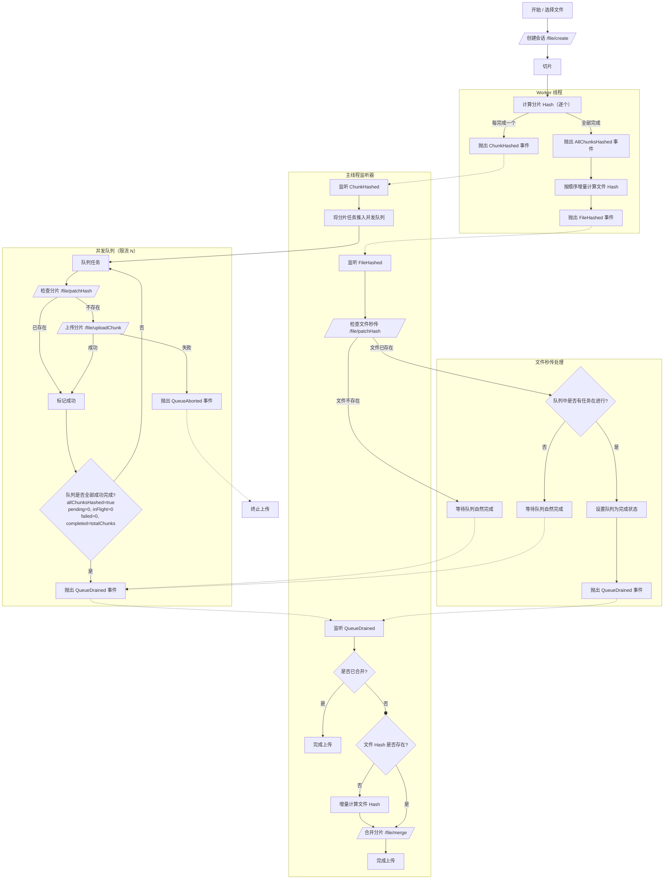

# 大文件分片上传流程

## 整体流程

核心思想是并发计算 Hash 与上传分片，并将文件秒传的检查时机提前。

### 文字描述

1.  **会话创建**: 用户选择文件后，进行基本校验，然后请求 `/file/create` 接口创建上传会话，获取用于后续所有请求身份验证的 `token`。

2.  **分片与 Hash 计算 (Worker)**:
    - 文件被切割成多个分片。
    - 在 Worker 线程中，逐个计算分片的 Hash。
    - 每计算完一个分片，抛出 `ChunkHashed` 事件，并附带分片信息。
    - 所有分片 Hash 计算完毕后，抛出 `AllChunksHashed` 事件。
    - 随后，Worker 会按顺序增量计算出整个文件的 Hash，并抛出 `FileHashed` 事件。

3.  **并发上传队列**:
    - 主线程监听 `ChunkHashed` 事件，每接收到一个事件，就将一个分片上传任务推入并发队列。
    - 队列有并发限制（例如，同时最多上传 N 个分片）。
    - 每个队列任务首先请求 `/file/patchHash` 检查分片是否已存在于服务端（秒传）。
      - **已存在**: 该分片标记为上传成功，无需重复上传。
      - **不存在**: 请求 `/file/uploadChunk` 上传分片。上传成功后标记为完成。
    - 若任一分片上传失败，整个队列将被中止，并标记上传失败。
    - 当所有分片任务都成功完成时（`completed === totalChunks`），并且所有分片 Hash 都已计算完成（`allChunksHashed === true`），队列会抛出 `QueueDrained` 事件。

4.  **文件秒传检查与合并**:
    - 主线程监听 `FileHashed` 事件，接收到文件 Hash 后，立即请求 `/file/patchHash` 检查文件是否已存在于服务端。
      - **文件已存在 (秒传)**:
        - 如果并发队列中仍有正在上传的任务，将队列状态更改为全部已完成。抛出 `QueueDrained` 事件，直接进入合并阶段。
        - 否则，什么也不用做，让队列自然完成。
      - **文件不存在**:
        - 什么也不做，让队列自然完成

5.  **最终合并**:
    - 主线程监听 `QueueDrained` 事件。
    - 收到事件后，只要尚未合并，先检查本地文件 hash 是否已经存在，如果不存在就将所有分片 hash 按分片顺序增量计算作为 fileHash，然后请求 `/file/merge` 接口，通知服务端。
    - 合并成功后，整个上传过程完成。

> **注意**: 只有在所有分片都成功处理（`failed === 0`）的情况下，才能触发 `QueueDrained` 事件及后续的合并请求。

### 流程图 (Mermaid)

## 事件与状态定义

事件

- ChunkHashed ：单个分片 Hash 完成，产生一个队列任务。
- AllChunksHashed ：所有分片 Hash 已产生，不再新增任务。
- FileHashed ：文件 Hash 完成。
- QueueDrained ：并发队列全部成功完成（无任何失败）。
- QueueAborted ：出现不可恢复失败，队列被中止（失败路径）。

计数

- totalChunks ：总分片数。
- pending ：待调度任务数。
- inFlight ：执行中的任务数。
- completed ：成功任务数（含“已存在跳过”的成功路径）。
- failed ：失败任务数（仅用于报警/中止，不参与“完成”状态）。

队列全部处理完成的判定条件

- allChunksHashed === true （已经确定不会再新增任务）
- pending === 0 （无待开始任务）
- inFlight === 0 （无执行中的任务）
- failed === 0 （没有任何失败）
- completed === totalChunks （全部任务均成功）

满足上述条件才触发 QueueDrained 。否则：

- 一旦 failed > 0 ，立即触发 QueueAborted 并中止后续流程（见下文“失败处理”）。

失败处理（不允许失败）

- 单任务失败时：当任务失败时，设置 failed++ ，立即中止队列并发出 QueueAborted ，取消一切未开始和进行中的任务，标记上传失败。
- 不将"失败"视为"完成"的一部分；失败不会触发 QueueDrained 。
- 任一分片 Hash 或文件 Hash 计算失败/中断，视为不可恢复失败，直接触发 QueueAborted。

## 边界情况

- 不允许空文件：不允许空文件上传（size=0）。

## 分片和文件 hash 计算

依赖于：Spark-MD5.js

分片 hash 与文件 hash 算法与规范：

- 分片 hash：对每个分片二进制数据计算 MD5（SparkMD5.ArrayBuffer）。输出为小写十六进制字符串，长度为 32。
- 文件 hash：将所有分片 hash 按分片顺序增量计算作为 fileHash。客户端与服务端必须严格一致（小写十六进制、无分隔符，或使用固定分隔符需一致）。
- 分片大小：使用固定 chunkSize（最后一个分片可小于 chunkSize）。chunkSize 需在客户端与服务端保持一致，以保证“秒传”一致性。
- Hash 计算失败/中断策略：任一分片或文件 Hash 计算失败/中断，直接触发 QueueAborted。

## API 契约

基础信息

- 基础路径：`/file`
- 认证：通过 `POST /file/create` 获取 `token`，其后在分片校验、上传、合并均需携带 `token`。`token` 为服务端签发的 JWT，默认有效期 1 小时。

接口列表

- POST `/file/create`
  - 用途：创建文件上传会话并返回 `token`。
  - Content-Type：`application/json`
  - 请求体：
    - `name: string` 文件名
    - `size: number` 文件大小（字节）
    - `type: string` MIME 类型
    - `chunksLength: number` 分片总数（≥1）
  - 成功响应：`200` `{ status: 'ok', token: string }`
  - 失败：抛出 5xx 异常（Nest 标准错误响应）

- POST `/file/patchHash`
  - 用途：哈希校验（分片/文件）。
  - Content-Type：`application/json`
  - 请求体：
    - `token: string`
    - `hash: string` 当 `type='chunk'` 时为分片哈希；当 `type='file'` 时为文件哈希
    - `type: 'chunk' | 'file'`
  - 成功响应：`200`
    - `{ status: 'ok', hasChunk: boolean }`
    - `{ status: 'ok', hasFile: boolean, url?: string }`
      - 当 `hasFile=true` 时，服务端将当前会话置为取消/完成清理态，并返回可下载 `url`（`url` 必填）；客户端需取消并忽略随后到达的回调错误。
  - 失败响应：`200` `{ status: 'error', message: 'Invalid token' | 'Invalid type' | 'Hash check failed' }`

- POST `/file/uploadChunk`
  - 用途：上传单个分片，存储分片二进制数据和 hash
  - Content-Type：`multipart/form-data`
  - 表单字段：
    - `blob: File` 分片二进制
    - 其余字段走表单键值（与 DTO）：
      - `token: string`
      - `hash: string` 分片哈希
      - `index: string` 分片索引
  - 成功响应：`200` `{ status: 'ok' }`
  - 幂等性：
    - 分片数据层面：同哈希的分片已存在则跳过保存；

- POST `/file/merge`
  - 用途：合并文件并返回下载 `url`
  - Content-Type：`application/json`
  - 请求体：
    - `token: string`
    - `hash: string` 文件哈希
  - 成功响应：`200`
    - 完整：`{ status: 'ok', url: string }`
  - 失败响应：`200` `{ status: 'error', url: '', message: 'File merge failed' }`
  - 说明：
    - 合并前服务端会用 `token` 更新文件的 `fileHash`（之前为空字符串）；
    - 如果合并时分片集合不完整，则查找已存储的相同文件 hash 的记录，如果该记录中的分片集合完整则补充到当前会话的分片集合。
    - 上述工作完成，则生成下载 `url`（在原文件名末尾追加 `_` + 完整 32 位哈希，再接扩展名）。

- GET `/file/:url`
  - 用途：下载文件，支持 `Range` 断点续传
  - 路径参数：`url` 为上一步合并后生成的文件 `url`（注意服务端会进行 `encodeURIComponent`/`decodeURIComponent` 处理）
  - 请求头（可选）：`Range: bytes=start-end`
  - 成功响应：
    - 全量：`200` 二进制流
    - 范围：`206` 二进制流，并返回 `Content-Range`/`Content-Length`/`Accept-Ranges`
    - 通用下载头：`Content-Disposition: attachment; filename*=UTF-8''<url-encoded>`；`Content-Type: application/octet-stream`
  - 失败响应：
    - `404` `{ msg: '服务器没有该文件' }`
    - `416` `{ msg: 'Range Not Satisfiable' }`

字段与约束（来自 DTO）

- CreateFileDto
  - `name: string` 非空
  - `size: number` ≥ 0
  - `type: string` 非空
  - `chunksLength: number` 整数，≥ 1（禁止零分片）
- PatchHashDto
  - `token: string` 非空
  - `hash: string` 非空（32 位小写十六进制 MD5）
  - `type: 'chunk' | 'file'`
- UploadChunkDto（随表单一并提交）
  - `blob: File` 分片二进制
  - `token: string`
  - `hash: string`
  - `index: string`
- MergeFileDto
  - `token: string` 非空
  - `hash: string` 非空
