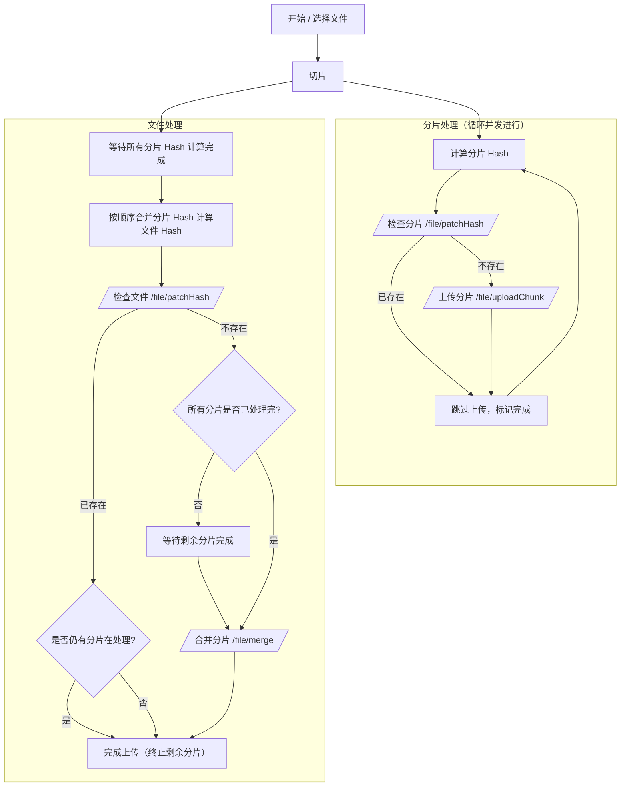

# 大文件分片上传流程

## 整体流程

分片完成后，立即放到 worker 中计算分片 hash，每完成一个分片 hash 的计算就立即调用接口 /file/patchHash 检查该分片是否已经上传，如果已经上传就不用再重复上传，如果没有上传就调用接口 /file/uploadChunk 上传分片数据。
如果所有的分片 hash 都计算完成，那么就立即在 worker 中按照分片顺序，根据每个分片的 hash 计算整个文件的 hash。整个文件的 hash 计算完成后，记录下来，并立即调用接口 /file/patchHash 检查该文件是否已经上传过。此时存在两种情况，要么还有分片数据需要检查并上传，要么所有分片数据都已经检查并上传完成。如果还有分片数据在检查并上传且整个文件已经上传过了，那么就结束分片数据的处理直接完成上传；如果还有分片数据在检查并上传且整个文件没有上传过，那么就继续分片的检查并上传，直到处理完最后一个分片数据调用接口 /file/merge 合并；如果所有的分片数据都已经处理完了且整个文件都已经上传过了，那么就直接结束完成上传；如果所有的分片数据都已经处理完了且整个文件没有上传过，那么就调用接口 /file/merge 合并。

### 流程图（Mermaid）

## 完善点

1. 错误处理与重试机制
   上面的流程描述了一个“成功路径”。在实际的网络环境中，任何一步API调用（检查Hash、上传分片、请求合并）都可能失败。
   分片上传失败：当 /file/uploadChunk 接口调用失败时（例如网络中断、服务器500错误），应该怎么办？建议引入重试机制，例如一个分片上传失败后，自动重试2-3次。如果最终还是失败，应该标记该分片为失败，并暂停后续所有操作，同时给用户明确的提示。
   接口请求失败：/file/patchHash 和 /file/merge 接口也需要同样的失败处理和重试逻辑。
2. 并发控制
   上面的方案提到“立即调用接口上传分片”，如果文件很大、分片很多（例如几百上千个），同时发起大量的并发请求可能会导致问题：
   浏览器限制：浏览器对同一域名下的并发TCP连接数是有限制的（通常是6-8个），过多的请求会被阻塞排队。
   服务器压力：瞬间的大量请求可能会对服务器造成冲击。
   建议：设置一个并发池（Concurrency Pool），控制同时上传的分片数量。例如，维护一个大小为5的上传队列，只有当一个分片上传成功后，才从待上传列表中取下一个分片进入队列。这样可以保证稳定、高效的上传。
3. 状态持久化与真正的“断点续传”
   上面的方案实现了“断点续传”的核心——即不重复上传已存在的分片。但如果用户在上传过程中关闭或刷新了浏览器，会发生什么？
   丢失进度：所有计算和上传的进度都会丢失，用户需要重新选择文件，从头开始（尽管已上传的分片不会真的再传一次，但整个检查流程需要重来）。
   建议：将文件的上传状态（例如：文件标识、总分片数、已完成上传的分片索引/Hash列表、整个文件的Hash等）存储在浏览器的 localStorage 中。当用户再次选择同一个文件时，程序首先检查 localStorage 中是否有未完成的上传任务，如果有，则可以从上次中断的地方继续，而无需重新计算所有Hash。这才是更完整的“断-点-续-传”。
4. 暂停与恢复功能
   在上述状态持久化的基础上，您可以很容易地为用户提供“暂停”和“恢复”上传的功能。暂停时，只需停止新的API请求；恢复时，根据保存的状态继续即可。
5. 文件Hash的计算方式
   方案中提到“根据每个分片的hash计算整个文件的hash”，这是一个非常好的性能优化，避免了再次读取整个文件。但需要明确具体算法，并确保客户端和服务端一致。
   常见做法：将所有分片的Hash值按顺序拼接成一个字符串，然后计算这个拼接后字符串的Hash（例如MD5或SHA-256），作为整个文件的最终Hash。
   注意：这种方式计算出的文件Hash与直接计算整个文件内容的Hash是不同的。您需要确保服务端也采用同样的逻辑来校验和生成文件Hash，以便实现“秒传”功能。

## 依赖

Spark-MD5
