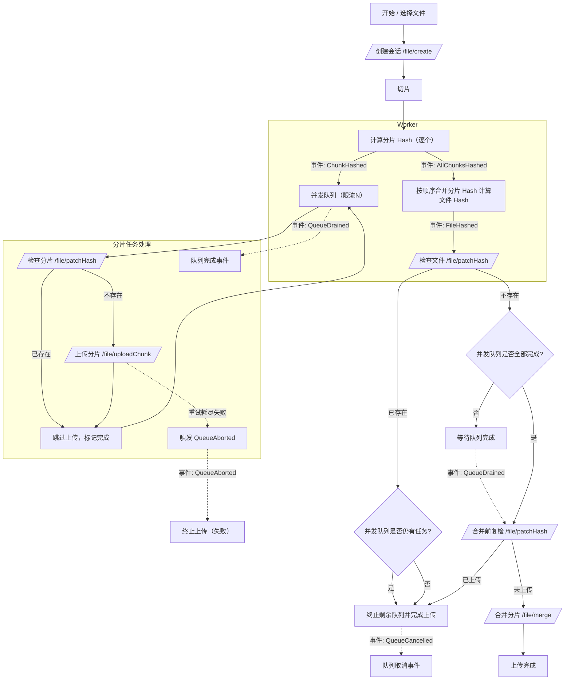

# 大文件分片上传流程

## 整体流程

用户选择文件后，首先调用 /file/create 创建上传会话，服务端返回 token。后续的分片哈希校验、分片上传与最终合并等所有请求均需携带该 token，用于会话校验与文件关联。

分片完成后，立即在 Worker 中计算分片 hash。每计算完一个分片 hash，抛出事件 ChunkHashed，将该分片任务推入“并发队列（限流 N）”。队列对每个分片执行：先调用 /file/patchHash 检查是否已存在；已存在则标记成功并跳过上传；不存在则调用 /file/uploadChunk 上传，成功后标记完成。允许重试，但不允许最终失败；若重试耗尽仍失败，则抛出 QueueAborted 事件并中止整个上传。

当所有分片 hash 都已计算完成时，抛出 AllChunksHashed 事件；随后在 Worker 中按顺序合并分片 hash 计算文件 hash，并抛出 FileHashed 事件。监听 FileHashed 后，调用 /file/patchHash 检查文件是否已上传：

- 已上传：若并发队列仍有进行中的任务，则主动终止它们并完成上传；若队列为空则直接完成上传。
- 未上传：等待队列“全部成功完成”（QueueDrained：要求 allChunksHashed、pending===0、inFlight===0、failed===0 且 completed===totalChunks），再调用 /file/merge 进行合并，合并成功后完成上传。

注意：不允许在存在失败（failed>0）的情况下触发 QueueDrained 或 /file/merge；出现不可恢复失败时触发 QueueAborted 并终止流程。

### 流程图（Mermaid）

## 事件与状态定义

事件

- ChunkHashed ：单个分片 Hash 完成，产生一个队列任务。
- AllChunksHashed ：所有分片 Hash 已产生，不再新增任务。
- FileHashed ：文件 Hash 完成。
- QueueDrained ：并发队列全部成功完成（无任何失败）。
- QueueAborted ：出现不可恢复失败，队列被中止（失败路径）。
- QueueCancelled ：文件已存在等正常提前结束时，主动取消剩余队列（成功路径）。

计数

- totalChunks ：总分片数。
- pending ：待调度任务数。
- inFlight ：执行中的任务数。
- completed ：成功任务数（含“已存在跳过”的成功路径）。
- failed ：失败任务数（仅用于报警/中止，不参与“完成”状态）。

队列全部处理完成的判定条件

- allChunksHashed === true （已经确定不会再新增任务）
- pending === 0 （无待开始任务）
- inFlight === 0 （无执行中的任务）
- failed === 0 （没有任何失败）
- completed === totalChunks （全部任务均成功）

满足上述条件才触发 QueueDrained 。否则：

- 一旦 failed > 0 ，立即触发 QueueAborted 并中止后续流程（见下文“失败处理”）。

全局守卫与一次性事件

- 全局状态：aborted（失败中止）、cancelled（正常取消）。所有监听器在执行前必须检查守卫：若已 aborted/cancelled 直接返回。
- 一次性事件：QueueDrained、QueueAborted、QueueCancelled 互斥且仅能发布一次（one-shot）。
- 时序约束：AllChunksHashed 必须在最后一个 ChunkHashed 发布之后再发布，避免“队列暂时为空”的误判。

触发合并的条件（文件未上传）

- FileHashed 后，调用 /file/patchHash 判断文件是否已上传：
  - 已上传：若 inFlight > 0 ，终止并发队列；否则直接完成上传。
  - 未上传：等待 QueueDrained ，在合并前再次调用 /file/patchHash 进行“合并前复检”；若此时已上传则直接完成；否则再触发 /file/merge 。
- 注意：不再允许 failed > 0 的情况下触发合并。

合并幂等与冲突处理

- 若 /file/merge 返回“已合并/已存在”（例如 409/412 等），视为幂等成功，直接进入“上传完成”。

失败处理（不允许失败）

- 单任务失败时：
  - 若支持重试：对该任务进行重试（建议指数退避 + 抖动）。
  - 当重试耗尽仍失败：设置 failed++ ，立即中止队列并发出 QueueAborted ，取消一切未开始和进行中的任务，标记上传失败。
- 不将“失败”视为“完成”的一部分；失败不会触发 QueueDrained 。

重试策略（建议）

- 分片级：/file/patchHash 与 /file/uploadChunk 失败采用指数退避重试（如最多 3 次，基于 200ms、400ms、800ms + 抖动）。
- 文件级：/file/patchHash 与 /file/merge 失败同样采用幂等重试策略（如最多 3-5 次）。
- 重试耗尽：分片级触发 QueueAborted 全局中止；文件级在合并阶段重试耗尽也视为失败中止。

终止与完成的时机

- 文件已存在路径：若并发队列仍有任务，使用统一的中止控制（如 AbortController）取消 in-flight 请求，并等待 inFlight===0 再对外宣告完成；同时发布 QueueCancelled（一次性）。
- 失败中止路径：触发 QueueAborted 后立即中止队列，拒绝一切后续事件的处理（受全局守卫保护）。

边界情况

- 零分片文件：totalChunks===0 时，仍应发布 AllChunksHashed 与 FileHashed；QueueDrained 条件自然成立（completed===0，failed===0）。流程可直接进入“合并前复检/合并或完成”。

## 分片和文件 hash 计算

依赖于：Spark-MD5.js

分片 hash 与文件 hash 算法与规范：

- 分片 hash：对每个分片二进制数据计算 MD5（SparkMD5.ArrayBuffer）。输出为小写十六进制字符串。
- 文件 hash（推荐）：将所有分片 hash 按分片顺序简单拼接成字符串 S，然后计算 MD5(S) 作为 fileHash。客户端与服务端必须严格一致（小写十六进制、无分隔符，或使用固定分隔符需一致）。
- 分片大小：使用固定 chunkSize（最后一个分片可小于 chunkSize）。chunkSize 需在客户端与服务端保持一致，以保证“秒传”一致性。
- 合并后校验：/file/merge 返回服务端计算的最终 fileHash，客户端应对比本地 fileHash，一致才视为成功；不一致应视为失败并根据策略重试或中止。

## API 契约

基础信息

- 基础路径：`/file`
- 认证：通过 `POST /file/create` 获取 `token`，其后在分片校验、上传、合并均需携带 `token`。`token` 为服务端签发的 JWT，默认有效期 1 小时。

接口列表

- POST `/file/create`
  - 用途：创建文件上传会话并返回 `token`。
  - Content-Type：`application/json`
  - 请求体：
    - `name: string` 文件名
    - `size: number` 文件大小（字节）
    - `type: string` MIME 类型
    - `chunksLength: number` 分片总数（≥1）
    - `hash?: string` 可选，文件哈希
  - 成功响应：`200` `{ status: 'ok', token: string }`
  - 失败：抛出 5xx 异常（Nest 标准错误响应）

- POST `/file/patchHash`
  - 用途：哈希校验（分片/文件）。
  - Content-Type：`application/json`
  - 请求体：
    - `token: string`
    - `hash: string` 当 `type='chunk'` 时为分片哈希；当 `type='file'` 时为文件哈希
    - `type: 'chunk' | 'file'`
  - 成功响应：`200`
    - `type='chunk'` → `{ status: 'ok', hasFile: boolean }`
    - `type='file'` → `{ status: 'ok', hasFile: boolean, url: string }`
      - 当 `hasFile=true` 时，服务端会清理当前 `token` 对应的会话，并返回可下载 `url`
  - 失败响应：`200` `{ status: 'error', message: 'Invalid token' | 'Invalid type' | 'Hash check failed' }`
  - 说明：服务端会先校验 `token` 有效性；此接口为幂等读操作。

- POST `/file/uploadChunk`
  - 用途：上传单个分片
  - Content-Type：`multipart/form-data`
  - 表单字段：
    - `blob: File` 分片二进制
    - 其余字段走表单键值（与 DTO）：
      - `token: string`
      - `hash: string` 分片哈希
      - `index: string` 分片索引（字符串形式）
      - `start?: string` 可选，分片起始
      - `end?: string` 可选，分片结束
  - 成功响应：`200` `{ status: 'ok' }`
  - 失败响应：
    - `400` `{ status: 'error', message: 'No file data provided' }`
    - `500` `{ status: 'error', message: 'Chunk upload failed' }`
  - 幂等性：
    - 分片数据层面：同哈希的分片已存在则跳过保存；
    - 文件关联层面：同 `token` + 分片哈希已关联过则跳过二次关联。

- POST `/file/merge`
  - 用途：合并文件（或完成索引修复）并返回下载 `url`
  - Content-Type：`application/json`
  - 请求体：
    - `token: string`
    - `hash: string` 文件哈希
  - 成功响应：`200`
    - 完整：`{ status: 'ok', url: string }`
    - 检测到缺失索引并修补记录后完成：`{ status: 'ok', url: string, message: 'Completed with missing chunks added' }`
  - 失败响应：`200` `{ status: 'error', url: '', message: 'File merge failed' }`
  - 说明：
    - 合并前服务端会用 `token` 更新文件的 `fileHash`；
    - 完整性判定基于已记录的分片数量与 `chunksLength`；
    - 若完整则生成下载 `url`（在原文件名末尾追加 `_` + 前 16 位哈希，再接扩展名）。

- GET `/file/:url`
  - 用途：下载文件，支持 `Range` 断点续传
  - 路径参数：`url` 为上一步合并后生成的文件 `url`（注意服务端会进行 `encodeURIComponent`/`decodeURIComponent` 处理）
  - 请求头（可选）：`Range: bytes=start-end`
  - 成功响应：
    - 全量：`200` 二进制流
    - 范围：`206` 二进制流，并返回 `Content-Range`/`Content-Length`/`Accept-Ranges`
    - 通用下载头：`Content-Disposition: attachment; filename*=UTF-8''<url-encoded>`；`Content-Type: binary/octet-stream`
  - 失败响应：`404` `{ msg: '服务器没有该文件' }`

字段与约束（来自 DTO）

- CreateFileDto
  - `name: string` 非空
  - `size: number` ≥ 0
  - `type: string` 非空
  - `chunksLength: number` 整数，≥ 1
  - `hash?: string`
- PatchHashDto
  - `token: string` 非空
  - `hash: string` 非空
  - `type: 'chunk' | 'file'`
- UploadChunkDto（随表单一并提交）
  - `token: string`
  - `hash: string`
  - `index: string` 非空（字符串）
  - `start?: string`，`end?: string`（可选）
- MergeFileDto
  - `token: string` 非空
  - `hash: string` 非空

返回值与状态码说明

- 大多数接口在业务失败时返回 `{ status: 'error', message: string }`，HTTP 状态常为 `200/400/500`（以控制器实现为准）。
- `download` 接口在未找到文件时返回 `404`。
- `patchHash(type=file)` 返回 `hasFile=true` 时，服务端会清理当前 `token` 对应的临时会话并返回 `url`。

幂等与副作用（与实现一致）

- `/file/patchHash`：读操作幂等。
- `/file/uploadChunk`：按分片哈希与文件关联去重，重复上传与重复关联不会产生重复数据。
- `/file/merge`：多次调用按实现一般可重复执行（若已设置 `url` 则返回同一 `url`）；建议客户端在合并前做一次“合并前复检”。
