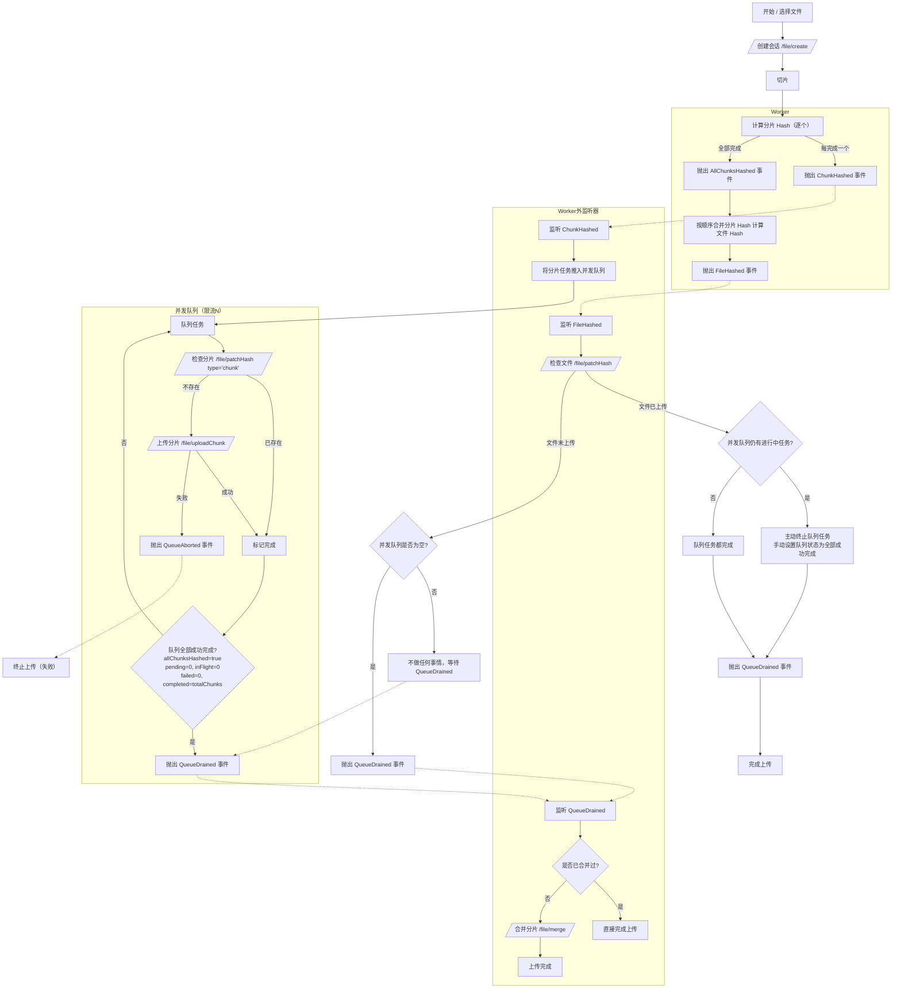

# 大文件分片上传流程

## 整体流程

用户选择文件后，首先调用 /file/create 创建上传会话，服务端返回 token。后续的分片哈希校验、分片上传与最终合并等所有请求均需携带该 token，用于会话校验与文件关联。

分片完成后，立即在 Worker 中计算分片 hash。每计算完一个分片 hash，抛出事件 ChunkHashed，在 Worker 外监听 ChunkHashed 事件将该分片任务推入"并发队列（限流 N）"。队列对每个分片执行：先调用 /file/patchHash(type='chunk') 检查是否已存在；已存在则标记成功并跳过上传；不存在则调用 /file/uploadChunk 上传，成功后标记完成。若上传失败，则抛出 QueueAborted 事件并中止整个上传。如果队列中的任务“全部成功完成”则抛出事件 QueueDrained（QueueDrained：要求 allChunksHashed、pending===0、inFlight===0、failed===0 且 completed===totalChunks）

当所有分片 hash 都已计算完成时，抛出 AllChunksHashed 事件；随后在 Worker 中按顺序合并分片 hash 计算文件 hash，并抛出 FileHashed 事件。在 Worker 外监听 FileHashed 后，调用 /file/patchHash 检查文件是否已上传：

- 已上传：若并发队列仍有进行中的任务，则主动终止任务队列中的任务，并手动将任务队列的状态设置为“全部成功完成”（allChunksHashed、pending===0、inFlight===0、failed===0 且 completed===totalChunks），并抛出事件 QueueDrained；若并发队列中的任务都完成则抛出事件 QueueDrained（allChunksHashed、pending===0、inFlight===0、failed===0 且 completed===totalChunks）。
- 未上传：若并发队列仍有进行中的任务，则不继续做任何事情；若队列为空，则抛出事件 QueueDrained（QueueDrained：要求 allChunksHashed、pending===0、inFlight===0、failed===0 且 completed===totalChunks）。

监听事件 QueueDrained 要做的事：如果正在合并则不做任何事情，如果合并过了则不继续做任何事情直接完成整个上传；否则调用 /file/merge 进行合并，合并成功后完成上传。

注意：不允许在存在失败（failed>0）的情况下触发 QueueDrained 或 /file/merge。

### 流程图（Mermaid）

## 事件与状态定义

事件

- ChunkHashed ：单个分片 Hash 完成，产生一个队列任务。
- AllChunksHashed ：所有分片 Hash 已产生，不再新增任务。
- FileHashed ：文件 Hash 完成。
- QueueDrained ：并发队列全部成功完成（无任何失败）。
- QueueAborted ：出现不可恢复失败，队列被中止（失败路径）。
- QueueCancelled ：文件已存在等正常提前结束时，主动取消剩余队列（成功路径）。

计数

- totalChunks ：总分片数。
- pending ：待调度任务数。
- inFlight ：执行中的任务数。
- completed ：成功任务数（含“已存在跳过”的成功路径）。
- failed ：失败任务数（仅用于报警/中止，不参与“完成”状态）。

队列全部处理完成的判定条件

- allChunksHashed === true （已经确定不会再新增任务）
- pending === 0 （无待开始任务）
- inFlight === 0 （无执行中的任务）
- failed === 0 （没有任何失败）
- completed === totalChunks （全部任务均成功）

满足上述条件才触发 QueueDrained 。否则：

- 一旦 failed > 0 ，立即触发 QueueAborted 并中止后续流程（见下文“失败处理”）。

失败处理（不允许失败）

- 单任务失败时：当任务失败时，设置 failed++ ，立即中止队列并发出 QueueAborted ，取消一切未开始和进行中的任务，标记上传失败。
- 不将"失败"视为"完成"的一部分；失败不会触发 QueueDrained 。
- 任一分片 Hash 或文件 Hash 计算失败/中断，视为不可恢复失败，直接触发 QueueAborted。

## 会话过期与恢复

- `token` 默认有效期 1 小时。上传过程中若任一接口返回 `{ status: 'error', message: 'Invalid token' }` 或 401/403（且当前并非取消/完成清理态），视为不可恢复失败。
- 客户端应立即触发 QueueAborted，取消全部未开始与进行中的分片任务；不进行续期或会话重建（若需续期属于未来扩展，不在本文档范围内）。

边界情况

- 禁止零分片：chunksLength 必须 ≥ 1。若检测到 0 分片，直接拒绝并返回错误响应。
- 空文件：不允许空文件上传（size=0）。若检测到空文件，直接拒绝并返回错误响应。

## 分片和文件 hash 计算

依赖于：Spark-MD5.js

分片 hash 与文件 hash 算法与规范：

- 分片 hash：对每个分片二进制数据计算 MD5（SparkMD5.ArrayBuffer）。输出为小写十六进制字符串，长度为 32。
- 文件 hash（推荐）：将所有分片 hash 按分片顺序简单拼接成字符串 S，然后计算 MD5(S) 作为 fileHash。客户端与服务端必须严格一致（小写十六进制、无分隔符，或使用固定分隔符需一致）。
- 分片大小：使用固定 chunkSize（最后一个分片可小于 chunkSize）。chunkSize 需在客户端与服务端保持一致，以保证“秒传”一致性。
- Hash 计算失败/中断策略：任一分片或文件 Hash 计算失败/中断，直接触发 QueueAborted。

## API 契约

基础信息

- 基础路径：`/file`
- 认证：通过 `POST /file/create` 获取 `token`，其后在分片校验、上传、合并均需携带 `token`。`token` 为服务端签发的 JWT，默认有效期 1 小时。

接口列表

- POST `/file/create`
  - 用途：创建文件上传会话并返回 `token`。
  - Content-Type：`application/json`
  - 请求体：
    - `name: string` 文件名
    - `size: number` 文件大小（字节）
    - `type: string` MIME 类型
    - `chunksLength: number` 分片总数（≥1）
  - 成功响应：`200` `{ status: 'ok', token: string }`
  - 失败：抛出 5xx 异常（Nest 标准错误响应）

- POST `/file/patchHash`
  - 用途：哈希校验（分片/文件）。
  - Content-Type：`application/json`
  - 请求体：
    - `token: string`
    - `hash: string` 当 `type='chunk'` 时为分片哈希；当 `type='file'` 时为文件哈希
    - `type: 'chunk' | 'file'`
  - 成功响应：`200`
    - `{ status: 'ok', hasChunk: boolean }`
    - `{ status: 'ok', hasFile: boolean, url?: string }`
      - 当 `hasFile=true` 时，服务端将当前会话置为取消/完成清理态，并返回可下载 `url`（`url` 必填）；客户端需取消并忽略随后到达的回调错误。
  - 失败响应：`200` `{ status: 'error', message: 'Invalid token' | 'Invalid type' | 'Hash check failed' }`

- POST `/file/uploadChunk`
  - 用途：上传单个分片，存储分片二进制数据和 hash
  - Content-Type：`multipart/form-data`
  - 表单字段：
    - `blob: File` 分片二进制
    - 其余字段走表单键值（与 DTO）：
      - `token: string`
      - `hash: string` 分片哈希
  - 成功响应：`200` `{ status: 'ok' }`
  - 幂等性：
    - 分片数据层面：同哈希的分片已存在则跳过保存；

- POST `/file/merge`
  - 用途：合并文件并返回下载 `url`
  - Content-Type：`application/json`
  - 请求体：
    - `token: string`
    - `hash: string` 文件哈希
  - 成功响应：`200`
    - 完整：`{ status: 'ok', url: string }`
  - 失败响应：`200` `{ status: 'error', url: '', message: 'File merge failed' }`
  - 说明：
    - 合并前服务端会用 `token` 更新文件的 `fileHash`（之前为空字符串）；
    - 如果合并时分片集合不完整，则查找已存储的相同文件 hash 的记录，如果该记录中的分片集合完整则补充到当前会话的分片集合。
    - 上述工作完成，则生成下载 `url`（在原文件名末尾追加 `_` + 前 16 位哈希，再接扩展名）。

- GET `/file/:url`
  - 用途：下载文件，支持 `Range` 断点续传
  - 路径参数：`url` 为上一步合并后生成的文件 `url`（注意服务端会进行 `encodeURIComponent`/`decodeURIComponent` 处理）
  - 请求头（可选）：`Range: bytes=start-end`
  - 成功响应：
    - 全量：`200` 二进制流
    - 范围：`206` 二进制流，并返回 `Content-Range`/`Content-Length`/`Accept-Ranges`
    - 通用下载头：`Content-Disposition: attachment; filename*=UTF-8''<url-encoded>`；`Content-Type: application/octet-stream`
  - 失败响应：
    - `404` `{ msg: '服务器没有该文件' }`
    - `416` `{ msg: 'Range Not Satisfiable' }`

字段与约束（来自 DTO）

- CreateFileDto
  - `name: string` 非空
  - `size: number` ≥ 0
  - `type: string` 非空
  - `chunksLength: number` 整数，≥ 1（禁止零分片）
- PatchHashDto
  - `token: string` 非空
  - `hash: string` 非空（32 位小写十六进制 MD5）
  - `type: 'chunk' | 'file'`
- UploadChunkDto（随表单一并提交）
  - `blob: File` 分片二进制
  - `token: string`
  - `hash: string`
- MergeFileDto
  - `token: string` 非空
  - `hash: string` 非空
