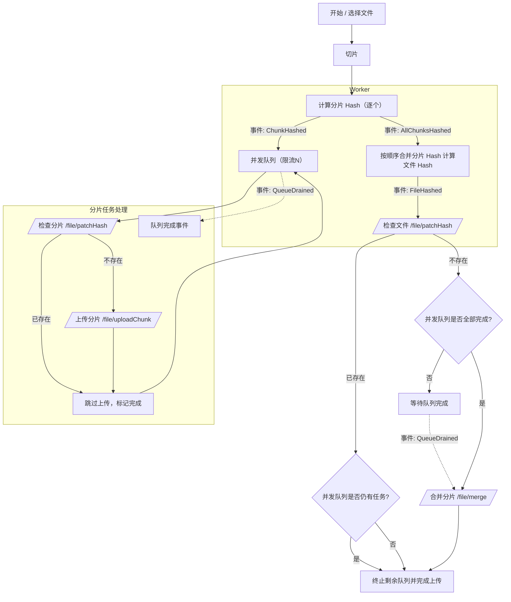

# 大文件分片上传流程

## 整体流程

分片完成后，立即在 Worker 中计算分片 hash。每计算完一个分片 hash，抛出事件 ChunkHashed，将该分片任务推入“并发队列（限流 N）”。队列对每个分片执行：先调用 /file/patchHash 检查是否已存在；已存在则标记成功并跳过上传；不存在则调用 /file/uploadChunk 上传，成功后标记完成。允许重试，但不允许最终失败；若重试耗尽仍失败，则抛出 QueueAborted 事件并中止整个上传。

当所有分片 hash 都已计算完成时，抛出 AllChunksHashed 事件；随后在 Worker 中按顺序合并分片 hash 计算文件 hash，并抛出 FileHashed 事件。监听 FileHashed 后，调用 /file/patchHash 检查文件是否已上传：

- 已上传：若并发队列仍有进行中的任务，则主动终止它们并完成上传；若队列为空则直接完成上传。
- 未上传：等待队列“全部成功完成”（QueueDrained：要求 allChunksHashed、pending===0、inFlight===0、failed===0 且 completed===totalChunks），再调用 /file/merge 进行合并，合并成功后完成上传。

注意：不允许在存在失败（failed>0）的情况下触发 QueueDrained 或 /file/merge；出现不可恢复失败时触发 QueueAborted 并终止流程。

### 流程图（Mermaid）

## 事件与状态定义

事件

- ChunkHashed ：单个分片 Hash 完成，产生一个队列任务。
- AllChunksHashed ：所有分片 Hash 已产生，不再新增任务。
- FileHashed ：文件 Hash 完成。
- QueueDrained ：并发队列全部成功完成（无任何失败）。
- QueueAborted ：出现不可恢复失败，队列被中止。

计数

- totalChunks ：总分片数。
- pending ：待调度任务数。
- inFlight ：执行中的任务数。
- completed ：成功任务数（含“已存在跳过”的成功路径）。
- failed ：失败任务数（仅用于报警/中止，不参与“完成”状态）。

队列全部处理完成的判定条件

- allChunksHashed === true （已经确定不会再新增任务）
- pending === 0 （无待开始任务）
- inFlight === 0 （无执行中的任务）
- failed === 0 （没有任何失败）
- completed === totalChunks （全部任务均成功）

满足上述条件才触发 QueueDrained 。否则：

- 一旦 failed > 0 ，立即触发 QueueAborted 并中止后续流程（见下文“失败处理”）。

触发合并的条件（文件未上传）

- FileHashed 后，调用 /file/patchHash 判断文件是否已上传：
  - 已上传：若 inFlight > 0 ，终止并发队列；否则直接完成上传。
  - 未上传：等待 QueueDrained ，再触发 /file/merge 。
- 注意：不再允许 failed > 0 的情况下触发合并。

失败处理（不允许失败）

- 单任务失败时：
  - 若支持重试：对该任务进行重试（建议指数退避 + 抖动）。
  - 当重试耗尽仍失败：设置 failed++ ，立即中止队列并发出 QueueAborted ，取消一切未开始和进行中的任务，标记上传失败。
- 不将“失败”视为“完成”的一部分；失败不会触发 QueueDrained 。

## 分片和文件 hash 计算

依赖于：Spark-MD5.js

分片 hash 基于分片二进制数据计算，文件 hash 基于所有分片 hash 按顺序合并计算。
