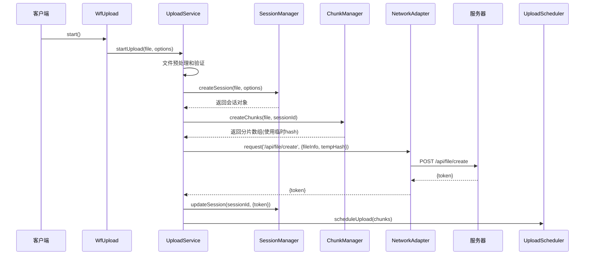
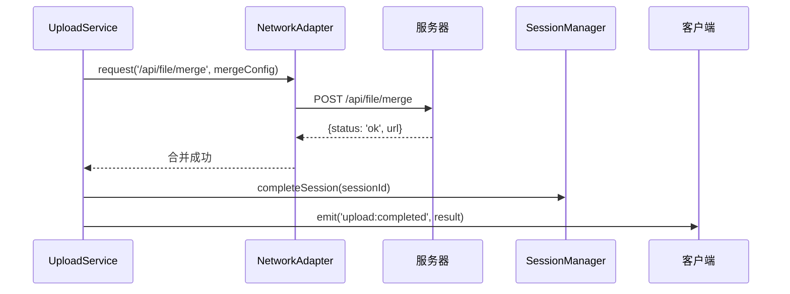
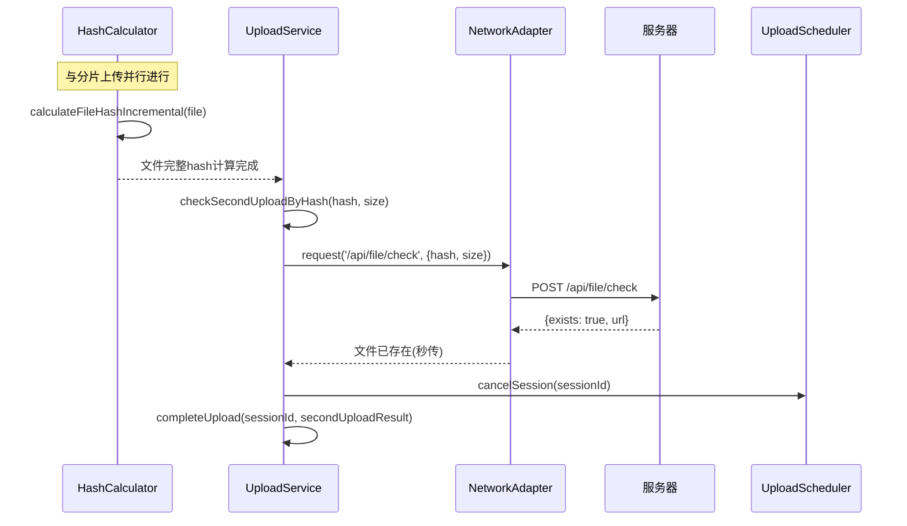

# @wf-upload/core 网络请求接口调用流程

## 概述

@wf-upload/core 是一个基于文件分片的大文件上传解决方案，采用分层架构设计，通过优化的网络请求策略实现高效、可靠的大文件上传。本文档详细描述了整个系统中的网络请求接口调用流程。

## 系统架构

```
┌─────────────────────────────────────────────────────────────┐
│                        WfUpload                             │
│                      (应用层 - API)                          │
└─────────────────────┬───────────────────────────────────────┘
                      │
┌─────────────────────▼───────────────────────────────────────┐
│                    UploadService                            │
│                  (应用服务层 - 协调)                         │
└─────────────────────┬───────────────────────────────────────┘
                      │
┌─────────────────────▼───────────────────────────────────────┐
│            ┌─────────────────────────────────────┐          │
│            │         UploadScheduler             │          │
│            │       (领域服务层 - 调度)            │          │
│            └─────────────────────────────────────┘          │
│                          │                                  │
│  ┌───────────────────────┼─────────────────────────────────┐ │
│  │                       │                                 │ │
│  ▼                       ▼                                 │ │
│ ┌─────────┐           ┌─────────────┐                      │ │
│ │ChunkMgr │           │SessionMgr   │                      │ │
│ └─────────┘           └─────────────┘                      │ │
└─────────────────────┬───────────────────────────────────────┘
                      │
┌─────────────────────▼───────────────────────────────────────┐
│                 NetworkAdapter                              │
│                (基础设施层 - 网络)                          │
└─────────────────────────────────────────────────────────────┘
```

## 核心网络接口

### 1. 创建文件记录
- **接口**: `POST /api/file/create`
- **功能**: 在服务器创建文件记录，获取上传token
- **请求参数**:
  ```typescript
  {
    name: string,        // 文件名
    type: string,        // 文件类型
    size: number,        // 文件大小
    hash: string,        // 文件hash(临时hash)
    chunksLength: number // 分片数量
  }
  ```
- **响应数据**:
  ```typescript
  {
    token: string        // 上传token，用于后续所有请求
  }
  ```

### 2. 上传文件分片
- **接口**: `POST {baseURL}/file/uploadChunk` (默认baseURL为 `/api`)
- **功能**: 上传单个文件分片
- **请求参数**: `multipart/form-data`
  ```
  token: string     // 上传token
  blob: Blob       // 分片数据
  hash: string     // 分片hash
  start: number    // 分片起始位置
  end: number      // 分片结束位置
  index: number    // 分片索引
  ```
- **响应数据**:
  ```typescript
  {
    status: string,  // 'ok' | 'error'
    message?: string, // 错误信息或状态描述
    data?: any       // 额外的响应数据
  }
  ```

### 3. 检查文件是否存在(秒传)
- **接口**: `POST /api/file/check`
- **功能**: 基于文件hash检查服务器是否已存在相同文件
- **请求参数**:
  ```typescript
  {
    hash: string, // 文件完整hash
    size: number  // 文件大小
  }
  ```
- **响应数据**:
  ```typescript
  {
    exists: boolean, // 文件是否存在
    url?: string     // 如果存在，返回文件访问URL
  }
  ```

### 4. 合并分片文件
- **接口**: `POST /api/file/merge`
- **功能**: 将所有已上传的分片合并为完整文件
- **请求参数**:
  ```typescript
  {
    token: string, // 上传token
    hash: string   // 文件完整hash
  }
  ```
- **响应数据**:
  ```typescript
  {
    status: string,  // 'ok' | 'error'
    url?: string,    // 合并后的文件访问URL
    message?: string // 状态信息
  }
  ```

### 5. 更新文件Hash
- **接口**: `POST /api/file/updateHash`
- **功能**: 更新文件的完整hash值
- **请求参数**:
  ```typescript
  {
    token: string, // 上传token
    hash: string   // 文件完整hash
  }
  ```

## 完整网络请求调用流程

### 阶段1: 初始化和文件预处理



### 阶段2: 分片上传和并发控制

```mermaid
sequenceDiagram
    participant Scheduler as UploadScheduler
    participant UploadSvc as UploadService
    participant Network as NetworkAdapter
    participant Server as 服务器
    participant ChunkMgr as ChunkManager

    Scheduler->>Scheduler: 创建上传任务队列
    Scheduler->>UploadSvc: execute(task)

    loop 每个分片任务
        UploadSvc->>ChunkMgr: getChunkBlob(file, chunkId)
        ChunkMgr-->>UploadSvc: 分片Blob数据

        UploadSvc->>Network: uploadChunk({
            url: '{baseURL}/file/uploadChunk',
            file: chunkBlob,
            token,
            hash,
            start,
            end,
            index
        })

        Network->>Server: POST {baseURL}/file/uploadChunk
        Note over Network: FormData格式传输
        Server-->>Network: {status: 'ok'}
        Network-->>UploadSvc: 上传成功

        UploadSvc->>ChunkMgr: markChunkCompleted(chunkId)

        alt 所有分片都完成
            UploadSvc->>UploadSvc: mergeFile(sessionId)
        end
    end
```

### 阶段3: 文件合并和完成



### 阶段4: 异步Hash计算和秒传检查



## 网络适配器技术实现

### 核心功能

NetworkAdapter 作为基础设施层的核心组件，提供以下功能：

#### 1. 请求拦截机制
```typescript
interface RequestInterceptor {
  request?: (config: RequestConfig) => RequestConfig | Promise<RequestConfig>
  response?: (response: any) => any | Promise<any>
  error?: (error: Error) => Error | Promise<Error>
}
```

#### 2. 自动重试机制
- 指数退避算法：`retryDelay * Math.pow(2, attempt)`
- 可配置重试次数和延迟时间
- 网络错误自动分类和重试策略

#### 3. 超时控制
- 基于 AbortController 的请求超时机制
- 可配置的全局和单次请求超时时间

#### 4. 错误处理
```typescript
private async executeRequest<T>(config: RequestConfig): Promise<T> {
  const { retryCount = 0, retryDelay = 1000 } = config
  let lastError: Error

  for (let attempt = 0; attempt <= retryCount; attempt++) {
    try {
      const response = await this.performRequest<T>(config)
      // 应用响应拦截器
      let processedResponse = response
      for (const interceptor of this.interceptors) {
        if (interceptor.response) {
          processedResponse = await interceptor.response(processedResponse)
        }
      }
      return processedResponse
    } catch (error) {
      lastError = error as Error
      // 应用错误拦截器
      for (const interceptor of this.interceptors) {
        if (interceptor.error) {
          lastError = await interceptor.error(lastError)
        }
      }

      if (attempt === retryCount) {
        throw lastError
      }

      // 指数退避重试
      if (retryDelay > 0) {
        await this.delay(retryDelay * Math.pow(2, attempt))
      }
    }
  }
  throw lastError!
}
```

## 并发控制和队列管理

### 上传调度器策略

UploadScheduler 实现了智能的任务调度和并发控制：

#### 1. 优先级队列
- 基于分片索引的优先级计算
- 第一个分片优先级最高
- 失败分片优先级递减

#### 2. 自适应并发控制
```typescript
getRecommendedConcurrency(): number {
  if (!this.config.enableAdaptiveConcurrency) {
    return this.config.maxConcurrency
  }

  const status = this.getScheduleStatus()
  const { errorRate, averageTaskTime, throughput } = status

  // 基于错误率调整
  if (errorRate > 20) {
    return Math.max(1, Math.floor(this.config.maxConcurrency * 0.5))
  } else if (errorRate > 10) {
    return Math.max(1, Math.floor(this.config.maxConcurrency * 0.7))
  }

  // 基于吞吐量调整
  if (throughput > 0 && averageTaskTime < 5000) {
    return Math.min(this.config.maxConcurrency + 1, 10)
  }

  return this.config.maxConcurrency
}
```

#### 3. 任务执行器接口
```typescript
interface TaskExecutor {
  execute(task: UploadTask): Promise<void>
  canExecute(task: UploadTask): boolean
  getEstimatedTime(task: UploadTask): number
}
```

## 断点续传机制

### 网络层面的实现

1. **分片状态持久化**: 使用 LocalStorage 存储分片上传状态
2. **会话恢复**: 基于sessionId恢复上传会话
3. **失败重试**: 自动识别失败分片并重新上传

```typescript
async resumeUpload(sessionId: string): Promise<void> {
  const session = await this.sessionManager.getSession(sessionId)
  await this.sessionManager.resumeSession(sessionId)

  // 获取待上传的分片
  const pendingChunks = await this.chunkManager.getPendingChunks(sessionId)
  if (pendingChunks.length > 0) {
    this.uploadScheduler.scheduleUpload(pendingChunks)
  }
}
```

## 秒传机制

### 网络流程

1. **异步Hash计算**: 文件分片上传的同时并行计算完整文件hash
2. **服务器检查**: 基于hash值检查服务器是否已存在相同文件
3. **快速完成**: 如果文件存在，直接完成上传，取消正在进行的分片上传

```typescript
private async calculateFileHashAsync(file: File, sessionId: string, enableSecondUpload: boolean): Promise<void> {
  try {
    // 并行计算文件哈希
    const fileHash = await this.hashCalculator.calculateFileHashIncremental(file, 'md5')

    // 检查秒传
    if (enableSecondUpload) {
      const secondUploadResult = await this.checkSecondUploadByHash(fileHash.hash, file.size, sessionId)
      if (secondUploadResult) {
        // 取消当前上传
        this.uploadScheduler.cancelSession(sessionId)
        await this.completeUpload(sessionId, secondUploadResult)
        return
      }
    }

    // 更新服务器文件hash
    await this.updateFileHashOnServer(sessionId, fileHash.hash)
  } catch (error) {
    // hash计算失败不影响上传继续进行
  }
}
```

## 错误处理策略

### 网络错误分类

1. **可重试错误**: 网络超时、临时服务器错误
2. **不可重试错误**: 文件不存在、权限错误、文件大小超限

### 错误恢复机制

1. **自动重试**: 指数退避算法
2. **手动重试**: 用户触发重试操作
3. **状态恢复**: 从本地存储恢复上传状态

```typescript
async retryUpload(sessionId: string): Promise<void> {
  // 获取失败的分片
  const failedChunks = await this.chunkManager.getFailedChunks(sessionId)

  // 重置失败分片的状态
  const chunkIds = failedChunks.map(chunk => chunk.id)
  await this.chunkManager.batchResetChunks(chunkIds)

  // 重新调度上传
  const retryableChunks = await this.chunkManager.getRetryableChunks(sessionId)
  if (retryableChunks.length > 0) {
    this.uploadScheduler.scheduleUpload(retryableChunks)
  }
}
```

## 性能优化策略

### 网络优化

1. **分片并行上传**: 可配置并发数(默认3个)
2. **智能分片大小**: 根据文件大小自动调整分片大小
3. **请求复用**: 复用HTTP连接减少握手开销
4. **压缩传输**: 可选的分片压缩功能

### 计算优化

1. **增量Hash计算**: Web Worker并行计算
2. **流式处理**: 避免大文件内存占用
3. **缓存策略**: 智能缓存分片状态

## URL配置说明

### baseURL配置
`baseURL` 是所有API请求的基础路径，默认值为 `/api`。实际的网络接口URL通过拼接形成：

- 创建文件记录: `POST {baseURL}/file/create`
- 上传文件分片: `POST {baseURL}/file/uploadChunk`
- 检查文件存在: `POST {baseURL}/file/check`
- 合并分片文件: `POST {baseURL}/file/merge`
- 更新文件Hash: `POST {baseURL}/file/updateHash`

**示例**:
```typescript
// 使用默认配置
const upload = new WfUpload(file, {
  baseURL: '/api' // 默认值
})
// 实际请求: POST /api/file/create

// 自定义API地址
const upload = new WfUpload(file, {
  baseURL: 'https://api.example.com/v1'
})
// 实际请求: POST https://api.example.com/v1/file/create
```

## 配置参数

```typescript
interface WfUploadOptions {
  // 网络配置
  baseURL?: string      // API基础URL (默认: '/api')，所有网络请求的基础路径
  timeout?: number      // 请求超时时间(ms)
  headers?: Record<string, string> // 请求头

  // 上传配置
  chunkSize?: number    // 分片大小(默认2MB)
  concurrency?: number  // 并发数(默认3)
  retryCount?: number   // 重试次数(默认3)
  retryDelay?: number   // 重试延迟(默认1000ms)

  // 功能开关
  enableSecondUpload?: boolean // 启用秒传(默认true)
  enableResume?: boolean       // 启用断点续传(默认true)
  enableProgress?: boolean     // 启用进度监控(默认true)
  enableRetry?: boolean        // 启用自动重试(默认true)
  autoCleanup?: boolean        // 自动清理(默认true)
}
```

## 总结

@wf-upload/core 的网络请求流程采用了现代化的分层架构设计，通过智能的并发控制、可靠的重试机制、高效的秒传功能，实现了稳定、快速的大文件上传体验。整个系统的网络层设计具有良好的可扩展性和容错性，能够适应各种复杂的网络环境。