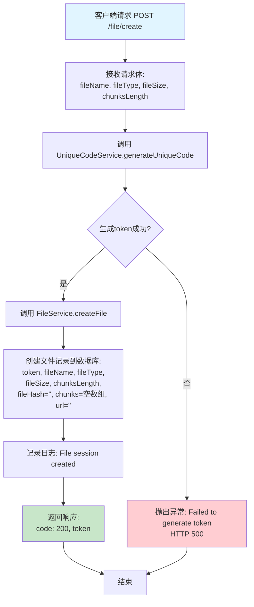
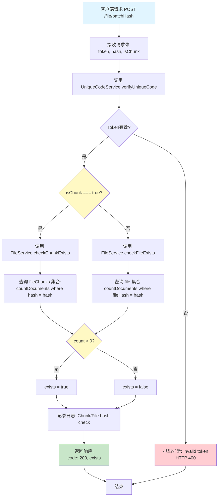
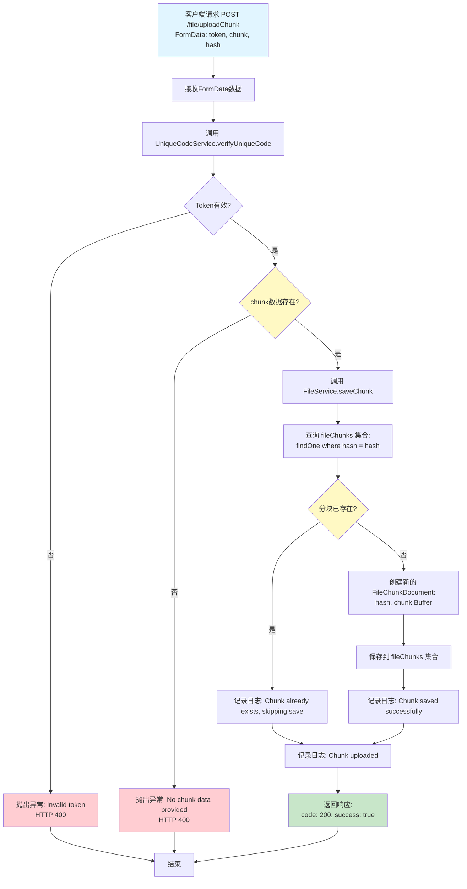
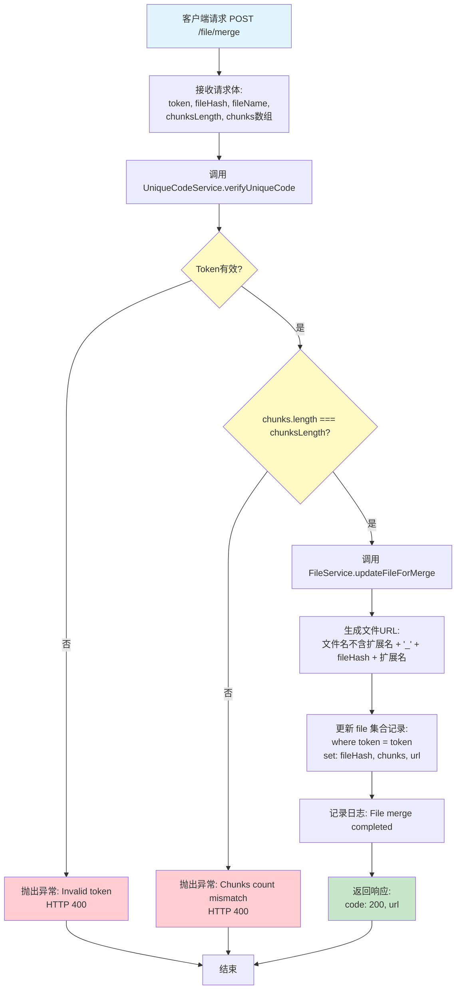
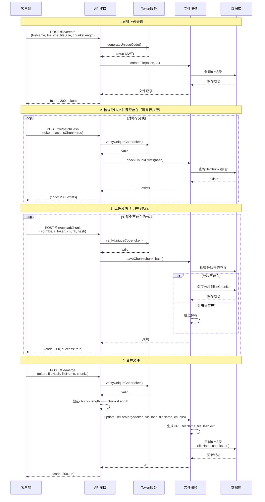
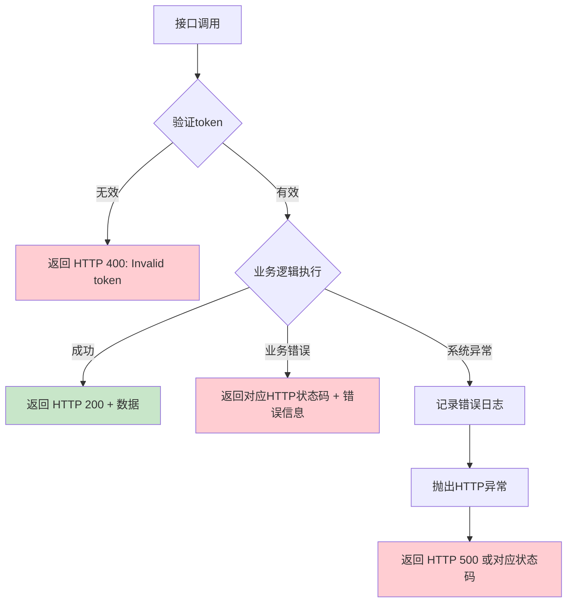

# 接口流程图

本文档包含所有4个接口的详细逻辑流程图，展示每个接口的关键步骤和决策点。

## 1. 会话创建接口 (`/file/create`)

创建文件上传会话，生成唯一token并初始化文件记录。

### 关键步骤说明

1. **接收请求参数**: 文件名、文件类型、文件大小、分块总数
2. **生成唯一token**: 使用UUID + JWT签名，有效期1小时
3. **创建数据库记录**: 在file集合中创建初始记录，状态字段为空
4. **返回token**: 客户端使用token进行后续操作

---

## 2. 分块/文件状态检查接口 (`/file/patchHash`)

检查特定分块或整个文件是否已存在于服务器（用于秒传功能）。

### 关键步骤说明

1. **验证token**: 确保请求来自有效的上传会话
2. **判断检查类型**: 根据isChunk字段决定检查分块还是文件
3. **查询数据库**:
   - 分块检查：查询fileChunks集合
   - 文件检查：查询file集合的fileHash字段
4. **返回存在状态**: 告知客户端是否已存在，用于跳过重复上传

---

## 3. 分块上传接口 (`/file/uploadChunk`)

上传单个文件分块，支持去重机制。

### 关键步骤说明

1. **验证token**: 确保请求来自有效的上传会话
2. **验证分块数据**: 检查chunk buffer是否存在
3. **去重检查**: 先查询fileChunks集合，避免重复存储相同hash的分块
4. **保存分块**: 如果不存在则创建新记录并保存二进制数据
5. **返回成功**: 无论是否已存在都返回成功（幂等性）

---

## 4. 文件合并接口 (`/file/merge`)

合并所有分块，完成文件上传流程。

### 关键步骤说明

1. **验证token**: 确保请求来自有效的上传会话
2. **验证分块数量**: 确保chunks数组长度与chunksLength一致
3. **生成文件URL**: 格式为 `文件名_fileHash.扩展名`
4. **更新数据库记录**: 填充fileHash、chunks数组和url字段
5. **返回文件URL**: 客户端可使用此URL访问上传完成的文件

---

## 完整上传流程总览

---

## 错误处理流程

所有接口遵循统一的错误处理机制：

---

## 数据库集合说明

### file 集合

- **用途**: 存储文件上传会话和最终文件信息
- **关键字段**: token, fileName, fileType, fileSize, chunksLength, fileHash, chunks[], url

### fileChunks 集合

- **用途**: 存储所有文件分块的二进制数据
- **关键字段**: hash, chunk (Buffer)
- **特点**: 支持去重，相同hash的分块只存储一次